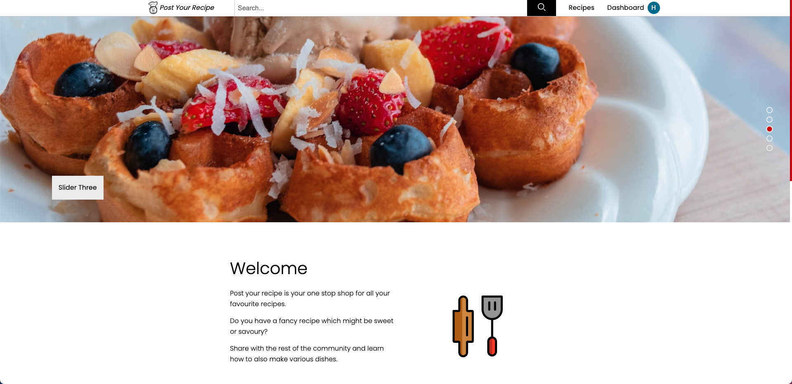
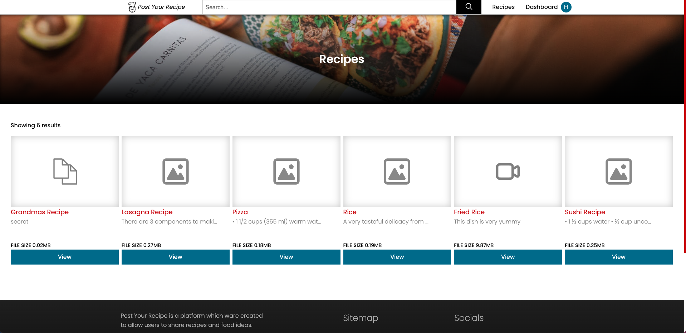
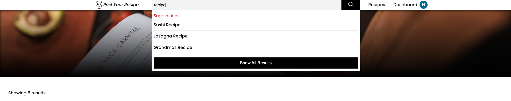
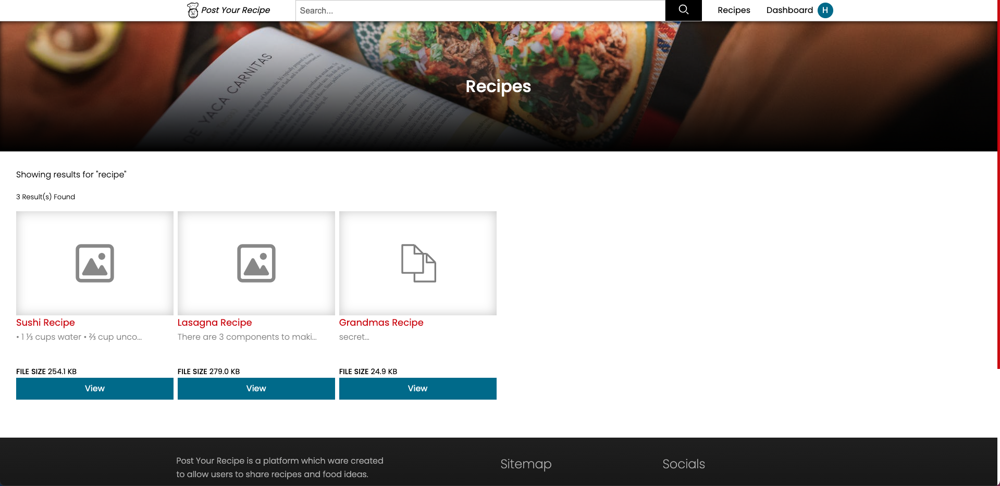
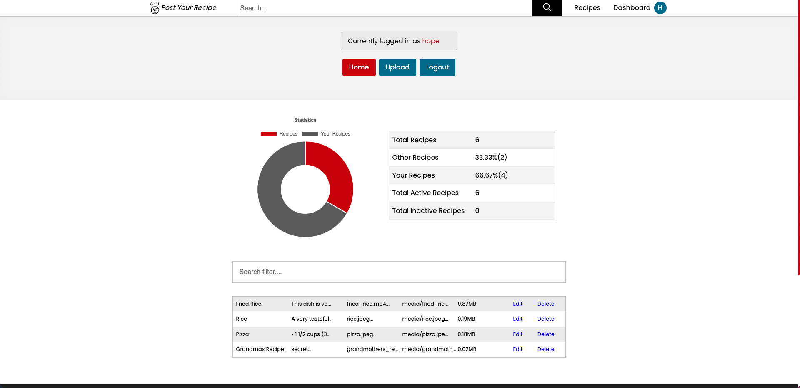
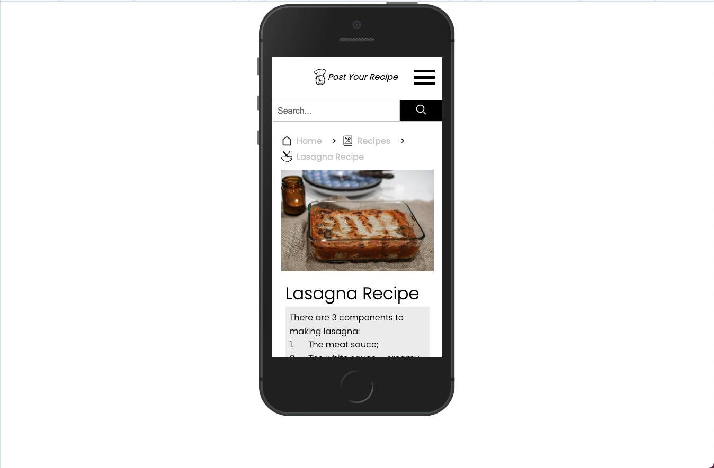
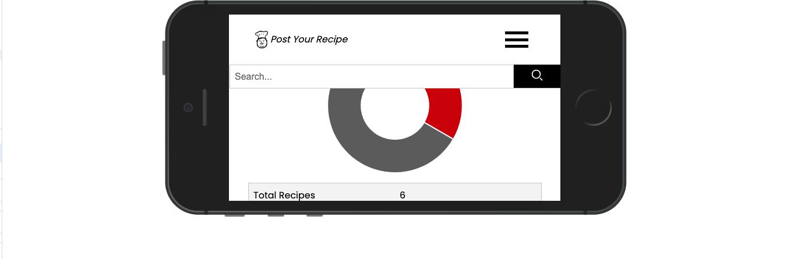
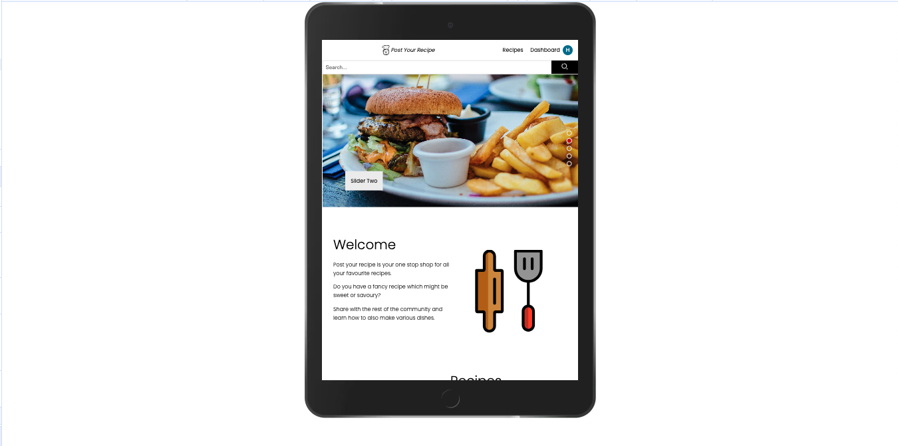
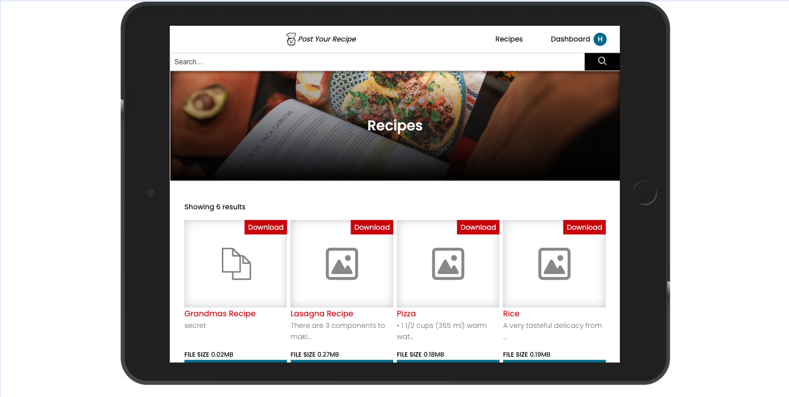
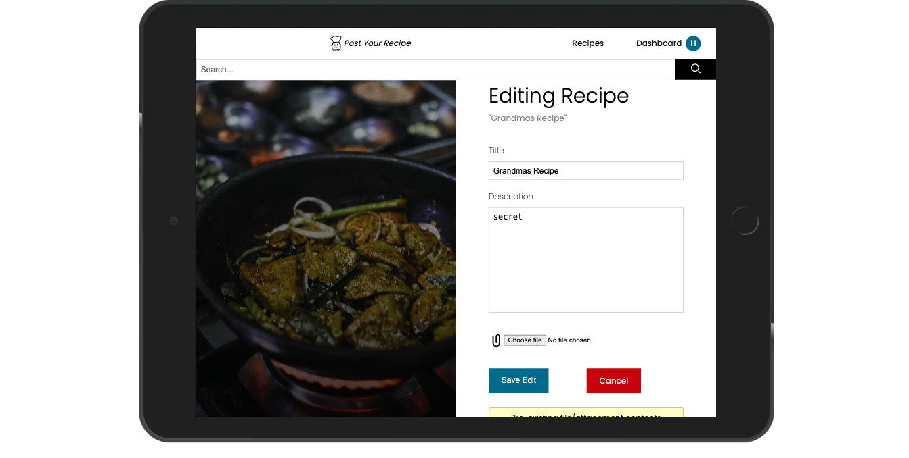

# Recipe Website

## Project Overview
- This project is the culmination of using the Python-Django framework, combined with front-end tools such as CSS and Javascript to create a platform where users can upload and share recipes.
- The inspiration came from a social-media driven mindset, with the project outlook looking to provide the end user with the ability to upload, edit and/or delete their posts



## Dependencies
- Django's authentication model was used for user registration and login
- MySQL for the relational database
- ChartJS script to creat fancy chart graphic in user dashboard
- Decorators such as @login_required to stop users from getting to dashboard/ upload/ edit/ delete/ URL aliases if they are not authenticated

## What I learned
- Django is an easy to use high-level framework to build web applications as it includes out of the box features such as authentication model, routing via the urls.py file config and the ability to create Models which can generate MySQL tables.
- How to create a slider using HTML/CSS/JS.

## Challenges faced
- Trying to overcome certain coding challenges like the real-time search. Having learnt about JSON before, it was hard trying to get things working but after some research and a bit of tinkering with the code, I discovered that if we can have some RESTFul api functions, this would make things easy.
- Using native Javascript asynchronously (fetch() api vs established libraries like JQuery and AJAX() requests).
- Making the project responsive using CSS.
- Some of these include **views.py**;
```
    def api_media_posts(request):
    def api_dashboard_data(request):
    def api_search_data(request)
```

## Conclusion
- I have learnt alot during my journey in the ALX program and I can only go further from this point in exploring other programming solutions which I can tackle and provide to end-users.

## Gallery









